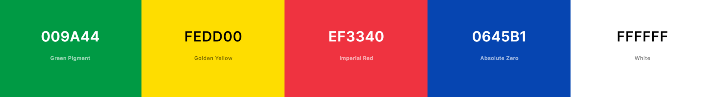
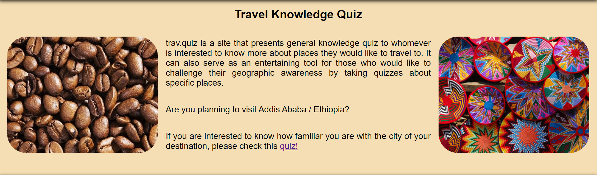

# trav.quiz

trav.quiz is a site that presents general knowledge quiz to whomeevr is interested to know more about places they would like to travel to. It can also serve as an enteraining tool fooor those who would like to challenge their geograhic awareness by taking quizzes about specific places.

The site mainly targets people who are enthusiastic about travel and provides basic information through online quizzes with inbuilt answers. trav.quiz is a fully responsive site that is committed to provide accurate infromation to the user. The system automatically grades the exercise when the user finalizes the quiz.

## Color Scheme

The colors used are inspire by the Ethiopian national flag.

I used [coolors.co](https://coolors.co/009a44-fedd00-ef3340-0645b1-ffffff) to generate the color palette.

- Blue: peace
- Yellow: hope, justice, and equality
- Red: sacrifice for freedom and equality
- Green: labour, development, and fertility

## Technologies Used

This website is developed using HTML, CSS and JavaScript programming languages. In addition the tools Gitpod, Github and Git are used.

 - [HTML](https://www.w3schools.com/html/) is used to create the content of the webpage.
 - [CSS](https://www.w3schools.com/css/) is used to style and specify the layout of the webpage.
 - [JavaScript](https://www.javascript.com/) is used to create interaction between the user and the webpage. 
 - [Gitpod](https://gitpod.io/) is used as an editor to write and run our code.
 - [GitHub](https://github.com/) is employed as code hosting platform, collaboration and securing our code against accidental or malicious loss.
 - [Git](https://git-scm.com/) is applied as a version control. 

## Features

The trav.quiz contains multiple questions, each question having four choices. Each question contains only one correct answer that the user is expected answer. 
 
### Existing Features

- __The landing page__

#### The header

- The header comprises an Ethioian flag and the site's name
    - This page welcomes a user with a header comprising an Ethiopian flag and site's name, welcome message, pictures of roasted coffee beans and colourful art works. The pictures are examples of what Ethiopia is known for. At the end of the welcoming text, a link that takes the user to the quiz is placed.

#### The content

- This page introduces travel.quiz and motivates the user to explore more ablout the places they plan to visit. It is also decorated with pictures of roasted coffee beans and colourful art works. The pictures are examples of what Ethiopia is known for. At the end of the welcoming text, a link that takes the user to the quiz is placed.

#### The footer

- The footer provides contact address of the site developer and administrator.

- __The quiz section__

- Clicking on the link at the end of the welcoming text takes to a new page that maintains the same header and footer as the landing page. In the middle of the new page, the user finds a start button that opens up to the first question.

This section will allow the user to take the online quiz. The user will be provided with five questions each containing 4 options. The user can select the answer by clicking the icon.

#### The quiz box

Each question will be marked either green (correct) or red (incorrect) when the user selects their answer.

#### The Total Score Area

This section will allow the user to see the total score the user get after completing the test.

### Features left to implement

- Currently the site contains a quiz for only one city/country. In the future, it aims to add a search engine an travellers can select their destination city/country and take the quiz.

## Testing

- The page is responsive and maintains its integrity when viewed on different size screens.

### Validator Testing 

#### HTML Code Validation

Using the official W3C validation tool to test the code, no errors were found, but some acceptable warnings are present.

- [index.html](https://validator.w3.org/nu/?doc=https%3A%2F%2Fhaimanota.github.io%2Fquiztour%2F)

- [quiz.html](https://validator.w3.org/nu/?doc=https%3A%2F%2Fhaimanota.github.io%2Fquiztour%2Fquiz.html)

#### CSS Code Validation

Using the official Jigaw validation tool to test the code, no errors or warnings were present.

- [style.css](https://jigsaw.w3.org/css-validator/validator?uri=https%3A%2F%2Fhaimanota.github.io%2Fquiztour%2F)

#### JavaScript Code Validation

No errors were found when passing through the official JShint validaton.

#### Accessibility 
 

### Unfixed Bugs

 - No bugs were discovered while creating and testing the project, that I'm aware of.

## Deployment

The site was deployed to GitHub pages. The steps to deploy are as follows: 
  - In the [GitHub repository](https://github.com/HaimanotA/quiztour), navigate to the Settings tab 
  - From the source section drop-down menu, select the **Main** Branch, then click "Save".
  - The page will be automatically refreshed with a detailed ribbon display to indicate the successful deployment.

The live link can be found [here](https://HaimanotA.github.io/quiztour)

### Local Deployment

In order to make a local copy of this project, you can clone it. In your IDE Terminal, type the following command to clone my repository:

- `git clone https://github.com/HaimanotA/quiztour.git`

Alternatively, if using Gitpod, you can click below to create your own workspace using this repository.

## Credits

**Content**

- Some questions were taken from [entrepreneur.com](https://www.entrepreneur.com/article/287422).
- Other questions were taken from [afktravel](https://afktravel.com/105067/quiz-much-know-ethiopia/).

**Media**

- The coffee beans image was borrowed from [pexels](https://www.pexels.com/search/coffee%20beans/).
- The African crafts image was borrowed from [pinterest](https://i.pinimg.com/600x315/ff/44/de/ff44de6f3a20d758ce8a4f522fb338a3.jpg).
- The flag of Ethiopia is from [wikipedia](https://en.wikipedia.org/wiki/Flag_of_Ethiopia).
- The favicon was borrowed from [countryflags.com](https://cdn.countryflags.com/thumbs/ethiopia/flag-button-square-250.png).

**Source Code**

- The JavaScript shuffle (Fisher Yates) was borrowed from [StackOverflow](https://stackoverflow.com/a/2450976).
- Part of the game functionality was learned from watching [YouTube](https://www.youtube.com/watch?v=riDzcEQbX6k).
