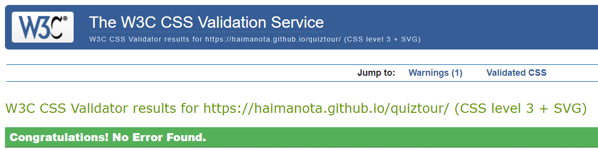

# trav.quiz

trav.quiz is a site that presents general knowledge quizzes to whomever is interested to know more about places they would like to travel to. It can also serve as an entertaining tool for those who would like to challenge their geographic awareness by taking quizzes about specific places.

The site mainly targets people who are enthusiastic about travel and provides basic information through online quizzes with inbuilt answers. trav.quiz is a fully responsive site that is committed to provide accurate information to the user. The system automatically grades the questions when the user finalizes the quiz.

## Technologies used

This website is developed using HTML, CSS and JavaScript programming languages. In addition the tools Gitpod, Github and Git are used.
 - HTML is used to create the content of the webpage.
 - CSS is used to style and specify the layout of the webpage.
 - JavaScript is used to create interaction between the user and the webpage. 
 - Gitpod is used as an editor to write and run the code.
 - Github is employed as code hosting platform, collaboration and securing our code against accidental or malicious loss.
 - Git is applied as a version control. 

## Existing Features

 The trav.quiz contains 21 questions, each having four choices. Each question contains only one correct answer that the user is expected to answer. 
 
### The Landing Page

- __The header__

  - The header comprises an Ethiopian flag and the site's name.

  - This page welcomes a user with a header comprising an Ethiopian flag and site's name, welcome message, pictures of roasted coffee beans and colourful art works. The pictures are examples of what Ethiopia is known for. At the end of the welcoming text, a link that takes the user to where the quiz is placed. 

- __The welcome message__

  - This page introduces trav.quiz and motivates the user to explore more about the places they plan to visit. It is also decorated with pictures of roasted coffee beans and colourful art works. The pictures are examples of what Ethiopia is known for. At the end of the welcoming text, a link that takes the user to the quiz is placed.

- __The footer__

  - The footer provides the contact address of the site developer and administrator. 

### The quiz section

  - Clicking on the link at the end of the welcoming text takes the user to a new page that maintains the same header and footer as the landing page. In the middle of the new page, the user finds a start button that opens up to the first question.

### The Questions

- This section provides the user with the actual questions. Twenty one questions, each with four alternative choices, are presented in this section. Up on clicking on one of the choices provided, the choice will be highlighted green or red where green signifies correct answer and red incorrect. In one second after, after attempting to answer the first question, the page opens up to the next question automatically until all the questions are completed.  

### The score

- Upon completing answering all the questions, the user will be prompted to click a submit button. This will produce a total score out of twenty one; and it will signify end of the exercise. 

## Color Schemes

- The colors green, blue and red are chosen to match with the flag of Ethiopia. A background-color of wheat is used as well to give the page a good contrast.

## Features left to implement

   - Currently the site contains a quiz for only one city/country. In the future, it aims to add a search engine to enable travellers to select their destination city/country and take respective quizzes.

## Testing

  - The page is responsive and maintains its integrity when viewed on different screen sizes. 

  - The page is tested on various browsers such as Microsoft edge, Google Chrome, and safari and it works perfectly.  
 

### Validator Testing 

- HTML Code Validation

  -  No errors were found. Three warning messages were displayed when passing the official W3C validation tool. [index.html](https://validator.w3.org/nu/?doc=https://haimanota.github.io/quiztour/index.html)

    

  -  No errors were found. Three warning messages were shown when passing the official W3C validation tool . [quiz.html](https://validator.w3.org/nu/?doc=https://haimanota.github.io/quiztour/quiz.html)

    

- CSS Code Validation

  - No errors or warnings were present when passing the W3C validation tool. [style.css](https://jigsaw.w3.org/css-validator/validator?uri=https%3A%2F%2Fhaimanota.github.io/quiztour/ (CSS level 3 + SVG))

- JavaScript code validation

  - No errors were found when passing through the official Jshint validaton. [script.js](jshint.com)

 

- Accessibility 
 

### Unfixed Bugs
 - No bugs were discovered while creating and testing the project.

## Deployment

The site was deployed to GitHub pages. The steps to deploy are as follows: 
  - In the [GitHub repository](https://github.com/HaimanotA/quiztour), navigate to the Settings tab 
  - From the source section drop-down menu, select the **Main** Branch, then click "Save".
  - The page will be automatically refreshed with a detailed ribbon display to indicate the successful deployment.

The live link can be found [here](https://haimanota.github.io/quiztour) 

### Local Deployment

In order to make a local copy of this project, you can clone it. In your IDE Terminal, type the following command to clone my repository:

- `git clone https://github.com/HaimanotA/quiztour.git`

Alternatively, if using Gitpod, you can click below to create your own workspace using this repository.

## Credits

**Content**

- The questions were taken from [afktravel.com](https://afktravel.com/105067/quiz-much-know-ethiopia/).

**Media**
- The three images on the landing page are taken from Google Photos. 

**Source Code**
-   The Javascript code which enables the question array to shuffle/randomize was taken from[stackoverflow.com](https://stackoverflow.com/a/2450976).
